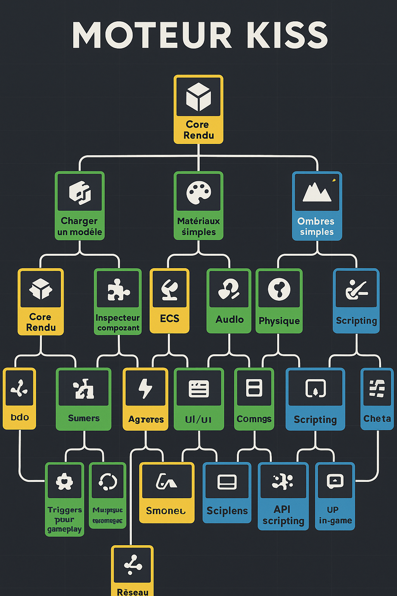

# Projet "Moteur KISS"

Un moteur de jeu développé étape par étape, avec un objectif de simplicité et d’apprentissage progressif.
Inspiré des arbres de compétences des RPG.

---

---

## 🎯 Golden Path – Étapes principales

1. **Core Rendu** – Initialiser l’API (OpenGL/Vulkan/WebGL), afficher un triangle puis un cube.
2. **Gestion de Scène** – Stocker, charger et manipuler les entités d’une scène.
3. **ECS (Entity Component System)** – Architecture entités + composants + systèmes.
4. **Audio & Physique** – Jouer des sons et gérer gravité/collisions simples.
5. **UI** – Afficher texte et boutons à l’écran.
6. **Scripting** – Ajouter un langage embarqué (Lua/Python) pour le gameplay.
7. **Éditeur** – Interface pour placer et modifier les entités visuellement.
8. **Réseau** – Communication client/serveur simple.

---

## 🗡 Quêtes secondaires

### Priorité Haute
- Core Rendu : Charger un modèle 3D (GLTF/OBJ).
- Gestion de Scène : Arbre parent/enfant.
- ECS : Inspecteur de composants.
- Physique : Triggers pour gameplay.
- Scripting : Hot-reload de scripts.
- Éditeur : Gizmos (Move/Rotate/Scale).

### Priorité Moyenne
- Core Rendu : Matériaux basiques (textures/couleurs).
- Gestion de Scène : Multi-scènes.
- ECS : Composants dynamiques à runtime.
- Audio : Sons spatialisés.
- Physique : Collisions avancées (mesh).
- UI : Système de layout.
- Éditeur : Vue multi-fenêtres.
- Réseau : Prediction & interpolation.

### Priorité Basse
- Core Rendu : Ombres simples.
- Gestion de Scène : Chargement automatique des assets.
- Audio : Musique en streaming.
- UI : Skins personnalisés.
- Réseau : Chat in-game.

---

## ⏳ Plan de travail hebdomadaire (exemple)

**Total : 10-15h/semaine**

- **2x 2h sessions** : Focus technique pur (ex. implémenter le rendu, ECS…)
- **1x 2h session** : Lecture/formation (cours, doc, vidéos).
- **1-2 sessions libres (2-3h)** : Tests, prototypage, quêtes secondaires.

---

## 📦 Organisation du dépôt

- /docs → Notes, schémas, README
- /src → Code source moteur
- /assets → Ressources (modèles, textures, sons)
- /tests → Projets de test

---

## 📝 Règles KISS

1. Chaque feature doit être implémentée de manière simple et claire.
2. Pas d’optimisation prématurée.
3. Une étape = un objectif clair avant de passer à la suivante.
4. Le code doit être lisible par un débutant intéressé par le moteur.
